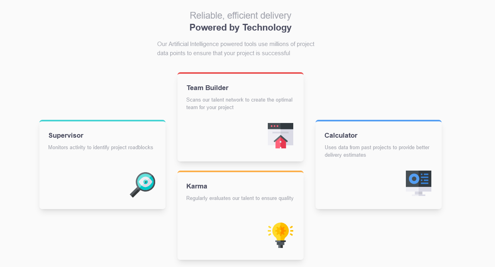

# Frontend Mentor - Four card feature section solution

This is a solution to the [Four card feature section challenge on Frontend Mentor](https://www.frontendmentor.io/challenges/four-card-feature-section-weK1eFYK).

## The challenge

Users should be able to:

- View the optimal layout for the site depending on their device's screen size

## Screenshot

## Links

- Solution URL: [Solution URL](https://github.com/JustShuaib/four-card)
- Live Site URL: [live site URL](https://shuaib-four-card.netlify.app/)

## Built with

- Semantic HTML5 markup
- Flexbox
- CSS Grid
- Tailwind CSS

## Author

- Website - [Adeoti Shuaib](https://www.github.com/JustShuaib)
- Frontend Mentor - [@justshuaib](https://www.frontendmentor.io/profile/justshuaib)
- Twitter - [@JustShuaib](https://www.twitter.com/JustShuaib)
